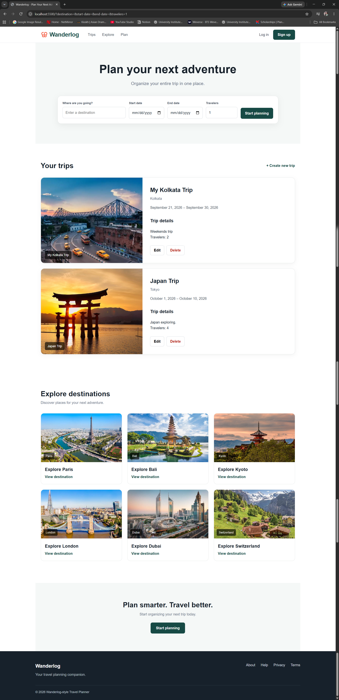
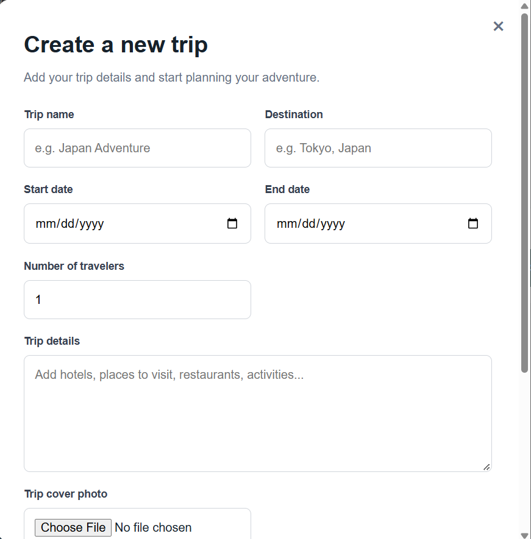
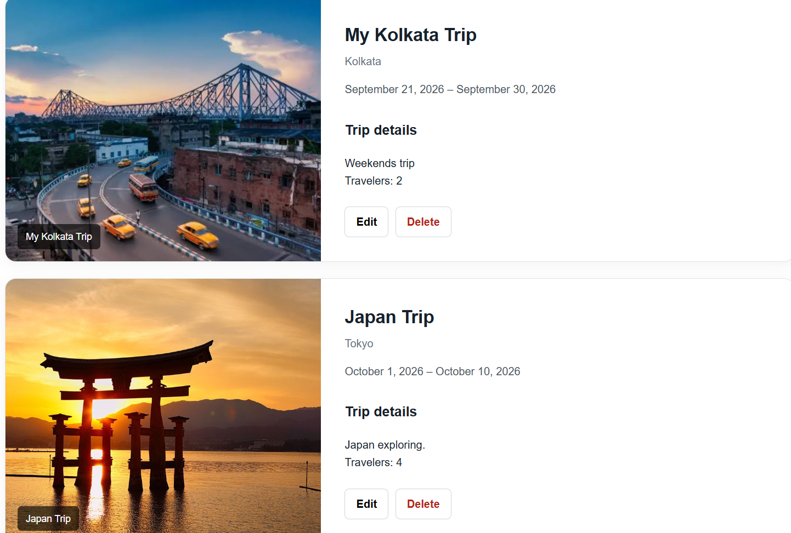
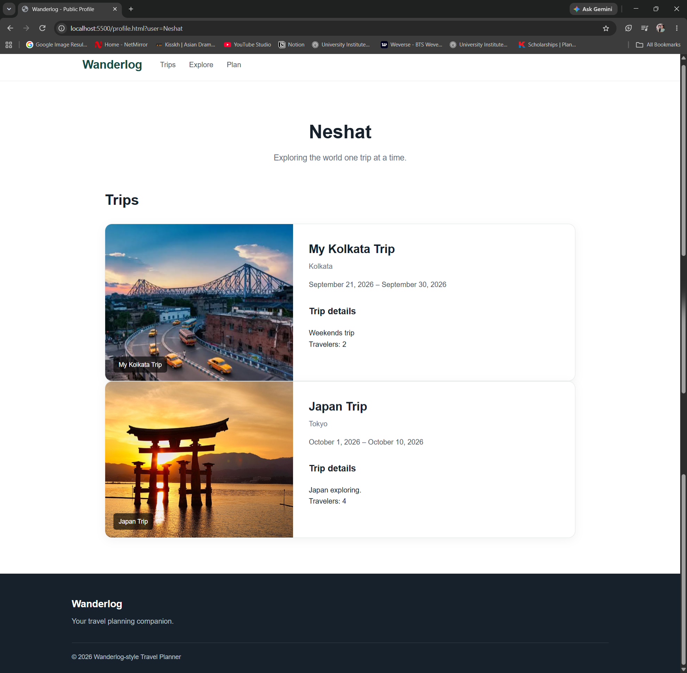

# Wanderlog

A responsive travel planning web application built as part of the **CodGen Frontend Internship Program**.

Wanderlog allows users to create and manage trips, add travel details and photos, explore destinations, and view trips through a public read-only profile page.

## Features

* Responsive travel planning homepage
* Create new trips
* View saved trips
* Edit existing trips
* Delete trips
* Save trip data using `localStorage`
* Trip date validation
* Traveler count
* Trip details and itinerary information
* Trip photo upload and preview
* Destination-based default images
* Public read-only profile page
* Empty-state messages when no trips are available
* Responsive design for mobile, tablet, and desktop
* Hover effects and button transitions
* Keyboard-focus accessibility
* Image alt text
* Semantic HTML5 structure
* Responsive destination cards
* Clean and user-friendly interface

## Technologies Used

* HTML5
* CSS3
* JavaScript
* Flexbox
* CSS Grid
* Local Storage
* FileReader API
* Responsive Web Design
* Git & GitHub

## Project Structure

```text
Wanderlog/
│
├── index.html
├── profile.html
├── style.css
├── script.js
│
├── images.jpeg
├── paris.jpeg
├── bali.jpg
├── kyoto.webp
├── london.jpeg
├── dubai.jpeg
├── switzerland.jpeg
├── japan.jpg
│
└── README.md
```

## How It Works

### Create a Trip

Users can create a trip by entering:

* Trip name
* Destination
* Start date
* End date
* Number of travelers
* Trip details
* Optional trip photo

Trip information is stored in the browser using `localStorage`.

### Edit and Delete Trips

Existing trips can be edited or deleted directly from the **Your Trips** section.

### Trip Photos

Users can upload a trip cover photo. The selected image is previewed before saving and stored locally using the FileReader API.

### Public Profile

Wanderlog includes a read-only public profile page that displays saved trips.

Example:

```text
profile.html?user=Neshat
```

## Responsive Design

The application has been tested across:

* Desktop
* Tablet
* Mobile

The layout adapts using CSS media queries, Flexbox, and CSS Grid.

## Accessibility

Basic accessibility improvements include:

* Semantic HTML elements
* Descriptive image `alt` text
* Labels for form controls
* Keyboard-navigable buttons and links
* Visible keyboard focus states
* Accessible navigation labels
* Clear empty and validation messages

## Screenshots

### Home Page


### Create Trip


### Saved Trip


### Public Profile


## Run Locally

1. Clone or download the repository.

2. Open the project folder in VS Code.

3. Open `index.html` using a local development server such as VS Code Live Server.

4. Open the displayed local URL in your browser.

## Deployment

The final Wanderlog project is deployed online.

**Live Demo:**
*Add your live deployment URL here.*

**GitHub Repository:**
https://github.com/Neshat-123/wanderlog
## Internship

This project was completed as part of the:

**CodGen Internship Program — Frontend Internship**

### Weekly Progress

* **Week 1:** Semantic HTML structure and responsive homepage
* **Week 2:** CRUD trip functionality using JavaScript and localStorage
* **Week 3:** Trip photo uploads and public read-only profile
* **Week 4:** Visual polish, interactions, accessibility, responsive testing, README, and deployment
